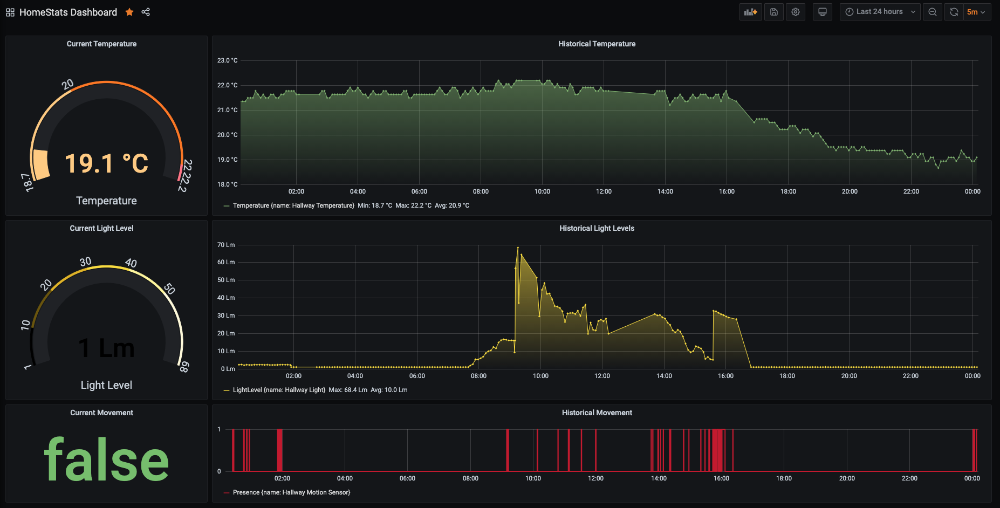

# HomeStats
HomeStats a personal project created primarily as an excuse to play around with Python, Docker, Docker Compose, InfuxDB and Grafana. Therefore some of the code may appear a little convoluted, this is was to allow me to familiarise myself with certain language features (rather than come up with the most succinct code).

HomeStats connects to 'home' sensors (initially Zigbee Light Link found on the Hue Motion Sensor accessed via via Hue Bridge) and stores select values such as Temperature, Light and Presence in a timeseries database (InfluxDB) which can than be viewed in a dashboard (Grafana).

## Quick Start
The project runs within docker containers, therefore the following steps assumes you have already installed docker-compose on your target host server and you have access to git.

```shell
git clone https://github.com/jonshuster/homestats.git
```
Edit the `.env.template` file adding appropriate values of your choice for the various usernames and passwords and save the file __without__ the `.template` suffix. 

Then build and start the containers (docker compose will figure this all out from the `docker-compose.yml` file, which should require no changes). Upon first run, this will likely take a while to pull the various container images.

```shell
docker-compose up
```

## Project Structure
- `src/`
    - Python source code for any scripts. Scripts are those polling Hue and storing values in the DB
- `cfg/`
    - Configuration files for scripts. Including the DB Ports and Hue Bridge info. 
- `grafana-provisioning/`
    - Grafana will import these `datasources` and `dashboard` definitions on startup 
- `.env`
    - Where the following keys need to be defined 
        - INFLUXDB_ADMIN_USER, INFLUXDB_ADMIN_PASSWORD, INFLUXDB_USER, INFLUXDB_USER_PASSWORD, GRAFANA_USERNAME, GRAFANA_PASSWORD, HUEBRIDGE_KEY
- `Dockerfile`
    - The docker file that specifies how the source code in this project, i.e the scripts should be build into an image
- `docker-compose.yml`
    - The docker compose configuration that brings together the image for this scripts built in this project alongside configuring existing publicly available images for the instances of the database and grafana

## Dashboard
Below is a preview of the dashboard that Grafana will come preconfigured with in this project.



## Ideas and TODO
As always there are plenty of ideas for next steps, missing or non optimal features.
- [ ] Hue Bridge Discovery - Use discovery services rather than fixed IP
- [ ] Support multiple sensors - Currently hits one bridge parsing data from all sensors in one go. Perhaps should support multiple with different refresh intervals for each sensor (eg. movement more often than temperature)
- [ ] Presence DataType - Consider storing presence/movement as a numeric rather than boolean for improved formatting in Grafana (Grafana can't value map booleans and influx won't let you cast boolean to integer in a SELECT)
